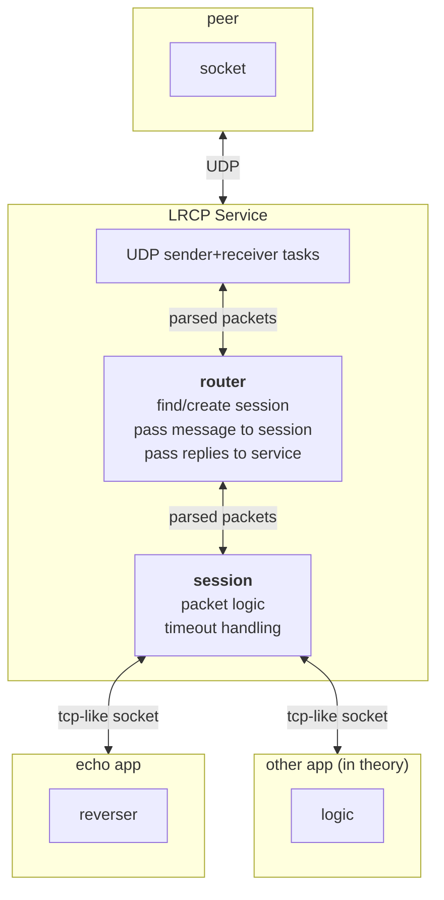

# 7: Line Reversal

https://protohackers.com/problem/7

```mermaid
flowchart TD
subgraph peer
  peersock[socket]
end
peer <--UDP--> service
subgraph service[LRCP Service]
  UDP[UDP sender+receiver tasks]
  UDP <-->|parsed packets| router
  router["`**router**
    find/create session
    pass message to session
    pass replies to service`"]
  session["`**session**
    packet logic
    timeout handling
    `"]
  router <-->|parsed packets| session
end
%% UDP --> router --> UDP
session <-->|tcp-like socket| app
session <-->|tcp-like socket| other-app
subgraph app[echo app]
  reverser
end
subgraph other-app["other app (in theory)"]
  logic
end
```
